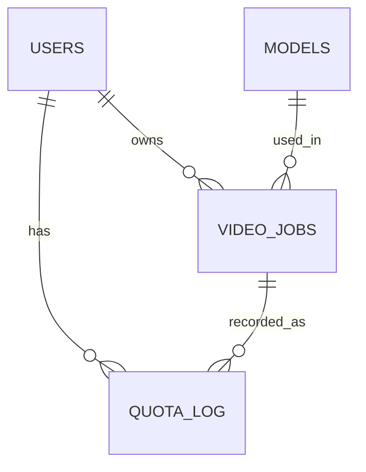

⸻

# 🗄️ Video App Data Schema – Final Version

**Date:** 2025-11-04

**Author:** [You]

**Purpose:**

Define the finalized database structure for the Video App, integrating user settings, credit system, and video generation history.

⸻

## 🎯 Schema Overview

```
users → video_jobs → quota_log (credit_log) → models
```

⸻

## 👤 Table: users

Stores user identity, authentication (optional), and preferences.

| Column | Type | Description |
|--------|------|-------------|
| id | uuid (PK) | Unique user ID |
| email | text | User email (nullable for guests) |
| device_id | text | Guest identification key (UUID stored in Keychain) |
| apple_sub | text | Apple Sign-In subject identifier |
| is_guest | boolean | true = anonymous user |
| tier | text | 'free' / 'premium' |
| credits_remaining | integer | Current available credits |
| **credits_total** | **integer** | **Total credits ever earned (audit trail)** |
| initial_grant_claimed | boolean | DeviceCheck verified first credit claim |
| language | text | User's preferred language ('en', 'tr', 'es') |
| theme_preference | text | 'system' / 'light' / 'dark' |
| **is_admin** | **boolean** | **Admin flag for admin tools access (default: false)** |
| created_at | timestamp | Record creation time |
| updated_at | timestamp | Auto-updated timestamp |

### Indexes:

```sql
CREATE INDEX idx_users_device_id ON users(device_id);
CREATE INDEX idx_users_apple_sub ON users(apple_sub);
```

### Notes:

- Either email or device_id must exist.
- Guests identified via device_id.
- Registered users linked via apple_sub.
- **credits_total** tracks lifetime credits for analytics (never decrements).
- **is_admin** enables access to admin endpoints (Phase 9).
- language and theme_preference sync with Profile Settings dropdowns.

⸻

## 🎬 Table: video_jobs

Stores every video generation request and its result.

| Column | Type | Description |
|--------|------|-------------|
| job_id | uuid (PK) | Unique job identifier |
| user_id | uuid (FK → users.id) | Owner of the job |
| model_id | uuid (FK → models.id) | Model used for generation |
| prompt | text | Text input used for generation |
| settings | jsonb | { duration, resolution, fps } |
| status | text | 'pending' / 'processing' / 'completed' / 'failed' |
| video_url | text | CDN or Supabase storage link |
| thumbnail_url | text | Small preview image (used in History) |
| credits_used | integer | Credits consumed per generation |
| error_message | text | Error message if failed |
| **provider_job_id** | **text** | **External provider's job ID (e.g., FalAI request_id)** |
| created_at | timestamp | Job creation timestamp |
| completed_at | timestamp | Job completion timestamp |

### Indexes:

```sql
CREATE INDEX idx_video_jobs_user ON video_jobs(user_id, created_at DESC);
CREATE INDEX idx_video_jobs_status ON video_jobs(status);
CREATE INDEX idx_video_jobs_provider ON video_jobs(provider_job_id);
```

### Notes:

- thumbnail_url added for History preview cards.
- Status allows ResultView polling and retry flow.
- **provider_job_id** enables tracking job status with external providers (FalAI, Runway, etc.).

⸻

## 🧠 Table: models

Metadata for all available video generation models.

| Column | Type | Description |
|--------|------|-------------|
| id | uuid (PK) | Model ID |
| name | text | Display name |
| category | text | 'text-to-video', 'image-to-video', etc. |
| description | text | Short summary |
| cost_per_generation | integer | Credits per use |
| provider | text | Model provider (fal, runway, pika) - lowercase |
| **provider_model_id** | **text** | **Provider's model identifier (e.g., "fal-ai/veo3.1")** |
| is_featured | boolean | Shown in carousel |
| **is_available** | **boolean** | **Model availability flag (admin-controlled, default: true)** |
| thumbnail_url | text | Preview image for HomeView |
| created_at | timestamp | Date added |

### Indexes:

```sql
CREATE INDEX idx_models_provider ON models(provider);
CREATE INDEX idx_models_featured ON models(is_featured) WHERE is_featured = true;
```

### Notes:

- Populates HomeView and ModelDetail Screen with metadata and cost.
- **provider_model_id** maps to external provider's API model identifier.
- **is_available** allows admins to disable/enable models without deleting them (Phase 9).

⸻

## 💳 Table: quota_log (credit_log equivalent)

Tracks every credit transaction for audit and analytics.

| Column | Type | Description |
|--------|------|-------------|
| id | uuid (PK) | Log entry ID |
| user_id | uuid (FK → users.id) | Owner |
| job_id | uuid (FK → video_jobs.job_id, nullable) | Related generation |
| change | integer | +10 (purchase) / -4 (generation) / +5 (bonus) |
| reason | text | 'generation', 'purchase', 'initial_grant', 'admin_refund' |
| transaction_id | text | Apple IAP original_transaction_id (unique) |
| **balance_after** | **integer** | **Credit balance after this transaction (audit trail)** |
| created_at | timestamp | Timestamp of transaction |

### Indexes:

```sql
CREATE INDEX idx_quota_log_user ON quota_log(user_id, created_at DESC);
CREATE INDEX idx_quota_log_transaction ON quota_log(transaction_id);
```

### Notes:

- This table enables credit history tracking, fraud detection, and accounting.
- **balance_after** provides point-in-time balance verification (detects tampering).
- transaction_id uniqueness prevents duplicate IAP credit grants.

⸻

## 🔄 Table: idempotency_log

Prevents duplicate operations (e.g., double-charging on network retry).

| Column | Type | Description |
|--------|------|-------------|
| idempotency_key | uuid (PK) | Client-generated unique key (from request header) |
| user_id | uuid (FK → users.id) | User who made the request |
| job_id | uuid (FK → video_jobs.job_id, nullable) | Related video job (if applicable) |
| operation_type | text | 'video_generation', 'credit_purchase', etc. |
| response_data | jsonb | Cached response to replay on duplicate request |
| status_code | integer | HTTP status code of original response |
| created_at | timestamp | First request timestamp |
| expires_at | timestamp | When to expire this key (default: 24 hours) |

### Indexes:

```sql
CREATE INDEX idx_idempotency_user ON idempotency_log(user_id, created_at);
CREATE INDEX idx_idempotency_expires ON idempotency_log(expires_at);
```

### Notes:

- iOS app generates UUID for each video generation request.
- If duplicate key is sent (e.g., network retry), backend returns cached response.
- Prevents double-charging users on poor network connections.
- Keys expire after 24 hours (auto-cleanup recommended via cron).

⸻

## ⚙️ Relationships



⸻

## 🔧 Stored Procedures

Atomic operations for credit management (prevent race conditions).

### `deduct_credits(p_user_id UUID, p_amount INTEGER, p_reason TEXT)`

**Purpose:** Atomically deduct credits from user account.

**Returns:** JSONB

```json
// Success
{
  "success": true,
  "credits_remaining": 6
}

// Insufficient credits
{
  "success": false,
  "error": "Insufficient credits",
  "current_credits": 2,
  "required_credits": 4
}

// User not found
{
  "success": false,
  "error": "User not found"
}
```

**Implementation:**
```sql
CREATE OR REPLACE FUNCTION deduct_credits(
    p_user_id UUID,
    p_amount INTEGER,
    p_reason TEXT DEFAULT 'video_generation'
) RETURNS JSONB AS $$
DECLARE
    current_credits INTEGER;
    new_balance INTEGER;
BEGIN
    -- Lock row to prevent race conditions
    SELECT credits_remaining INTO current_credits
    FROM users
    WHERE id = p_user_id
    FOR UPDATE;

    IF current_credits IS NULL THEN
        RETURN jsonb_build_object('success', false, 'error', 'User not found');
    END IF;

    IF current_credits < p_amount THEN
        RETURN jsonb_build_object(
            'success', false,
            'error', 'Insufficient credits',
            'current_credits', current_credits,
            'required_credits', p_amount
        );
    END IF;

    -- Deduct credits
    UPDATE users
    SET credits_remaining = credits_remaining - p_amount,
        updated_at = now()
    WHERE id = p_user_id
    RETURNING credits_remaining INTO new_balance;

    -- Log transaction
    INSERT INTO quota_log (user_id, change, reason, balance_after)
    VALUES (p_user_id, -p_amount, p_reason, new_balance);

    RETURN jsonb_build_object('success', true, 'credits_remaining', new_balance);
END;
$$ LANGUAGE plpgsql SECURITY DEFINER;
```

---

### `add_credits(p_user_id UUID, p_amount INTEGER, p_reason TEXT, p_transaction_id TEXT)`

**Purpose:** Atomically add credits to user account.

**Returns:** JSONB

```json
// Success
{
  "success": true,
  "credits_added": 10,
  "credits_remaining": 16
}

// Duplicate transaction
{
  "success": false,
  "error": "Transaction already processed"
}
```

**Implementation:**
```sql
CREATE OR REPLACE FUNCTION add_credits(
    p_user_id UUID,
    p_amount INTEGER,
    p_reason TEXT,
    p_transaction_id TEXT DEFAULT NULL
) RETURNS JSONB AS $$
DECLARE
    new_balance INTEGER;
    existing_transaction BOOLEAN;
BEGIN
    -- Check for duplicate transaction
    IF p_transaction_id IS NOT NULL THEN
        SELECT EXISTS(
            SELECT 1 FROM quota_log
            WHERE transaction_id = p_transaction_id
        ) INTO existing_transaction;

        IF existing_transaction THEN
            RETURN jsonb_build_object(
                'success', false,
                'error', 'Transaction already processed'
            );
        END IF;
    END IF;

    -- Add credits
    UPDATE users
    SET credits_remaining = credits_remaining + p_amount,
        credits_total = credits_total + p_amount,
        updated_at = now()
    WHERE id = p_user_id
    RETURNING credits_remaining INTO new_balance;

    -- Log transaction
    INSERT INTO quota_log (
        user_id, change, reason, balance_after, transaction_id
    ) VALUES (
        p_user_id, p_amount, p_reason, new_balance, p_transaction_id
    );

    RETURN jsonb_build_object(
        'success', true,
        'credits_added', p_amount,
        'credits_remaining', new_balance
    );
END;
$$ LANGUAGE plpgsql SECURITY DEFINER;
```

---

## 🔒 Security & Access Policies

### Row-Level Security (RLS) Policies

#### users table:
```sql
ALTER TABLE users ENABLE ROW LEVEL SECURITY;

-- Users can view own profile
CREATE POLICY "Users can view own profile"
ON users FOR SELECT
USING (auth.uid() = id);

-- Users can update own profile
CREATE POLICY "Users can update own profile"
ON users FOR UPDATE
USING (auth.uid() = id);
```

#### video_jobs table:
```sql
ALTER TABLE video_jobs ENABLE ROW LEVEL SECURITY;

-- Users can view own jobs
CREATE POLICY "Users can view own jobs"
ON video_jobs FOR SELECT
USING (auth.uid() = user_id);

-- Users can insert own jobs
CREATE POLICY "Users can insert own jobs"
ON video_jobs FOR INSERT
WITH CHECK (auth.uid() = user_id);
```

#### quota_log table:
```sql
ALTER TABLE quota_log ENABLE ROW LEVEL SECURITY;

-- Users can view own transactions
CREATE POLICY "Users can view own transactions"
ON quota_log FOR SELECT
USING (auth.uid() = user_id);
```

#### models table:
```sql
ALTER TABLE models ENABLE ROW LEVEL SECURITY;

-- Anyone can view available models
CREATE POLICY "Anyone can view available models"
ON models FOR SELECT
USING (is_available = true);
```

### Summary:

| Rule | Description |
|------|-------------|
| Row-Level Security | Enabled for users, video_jobs, quota_log, models, idempotency_log. |
| Access Scope | Each user/device only sees their own records (via `auth.uid()`). |
| Public Tables | Only models (read-only, filtered by `is_available = true`). |
| DeviceCheck Required | For initial credit grant (guest registration). |
| Storage Policy | Only owner can access their generated videos. |
| Anonymous Auth | Guests get JWT via `signInAnonymously()` for RLS compatibility. |

⸻

## 🧩 Example Data Snapshot

```json
{
  "user": {
    "id": "8c71a1b2-6fdd-4cbb-91b1-cc1cf2bb9e44",
    "device_id": "A1B2-C3D4-E5F6",
    "language": "en",
    "theme_preference": "system",
    "credits_remaining": 3
  },
  "video_job": {
    "job_id": "0a3d6b2f-6c11-4b22-b6db-9a6a17b6eaf2",
    "prompt": "a cinematic sunrise over the mountains",
    "status": "completed",
    "thumbnail_url": "https://cdn.app/videos/preview123.jpg",
    "video_url": "https://cdn.app/videos/123.mp4",
    "credits_used": 4
  },
  "quota_log": {
    "change": -4,
    "reason": "generation",
    "transaction_id": null
  }
}
```

⸻

## ✅ Next Steps

1. Create SQL migration scripts:
   - `/supabase/migrations/001_create_tables.sql`
   - `/supabase/migrations/002_create_stored_procedures.sql`
   - `/supabase/migrations/003_create_rls_policies.sql`

2. Implement API endpoints (Supabase Edge Functions):
   - `device-check` - Guest onboarding with DeviceCheck
   - `generate-video` - Create video generation job
   - `get-video-status` - Poll video generation status
   - `get-video-jobs` - Fetch user's video history
   - `get-user-credits` - Get current credit balance
   - `update-credits` - Process Apple IAP purchase
   - `get-models` - Fetch available models
   - `get-user-profile` - Get user profile data

3. Connect ProfileView dropdowns to `users.language` and `users.theme_preference`.

**Note:** Edge Function names use kebab-case without `/api` prefix (e.g., `supabase/functions/device-check/index.ts`).

⸻

**End of Document**

This schema serves as the canonical reference for database migrations and backend API development.

⸻
